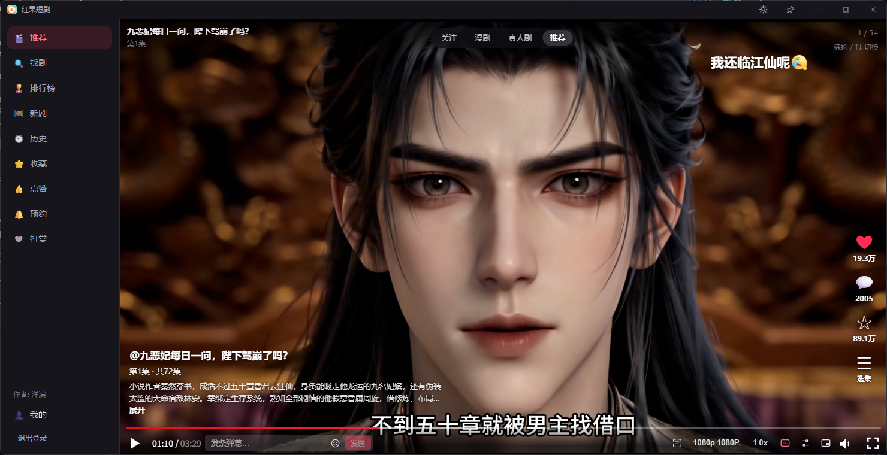
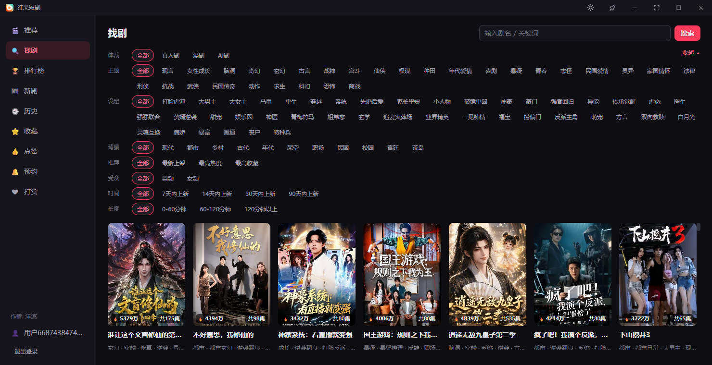
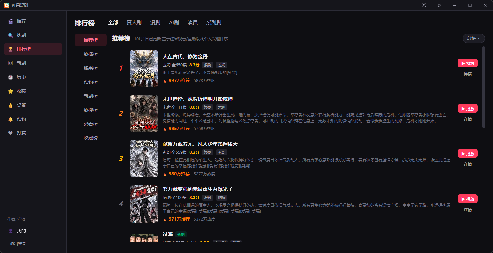
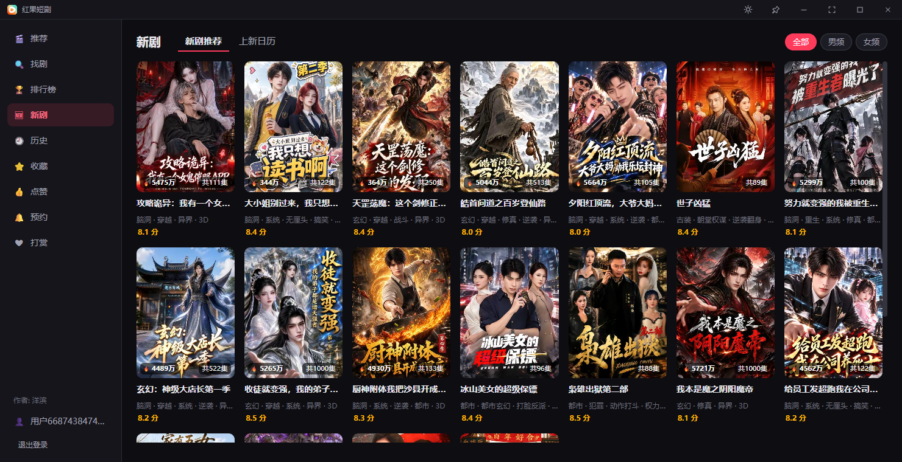
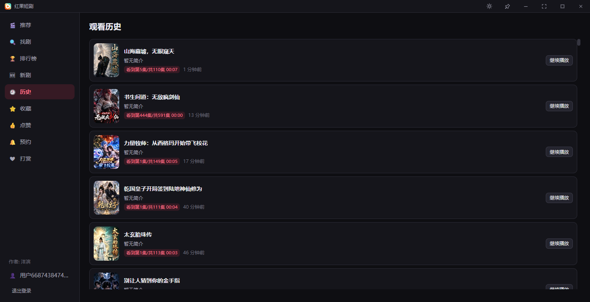
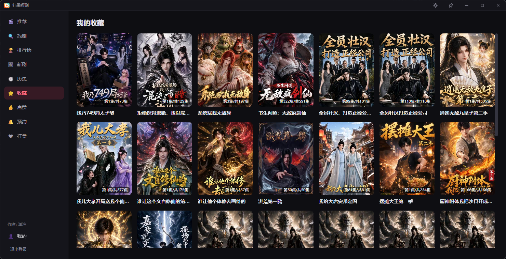
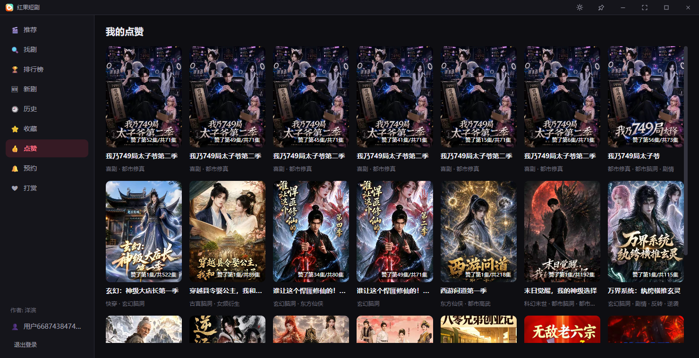
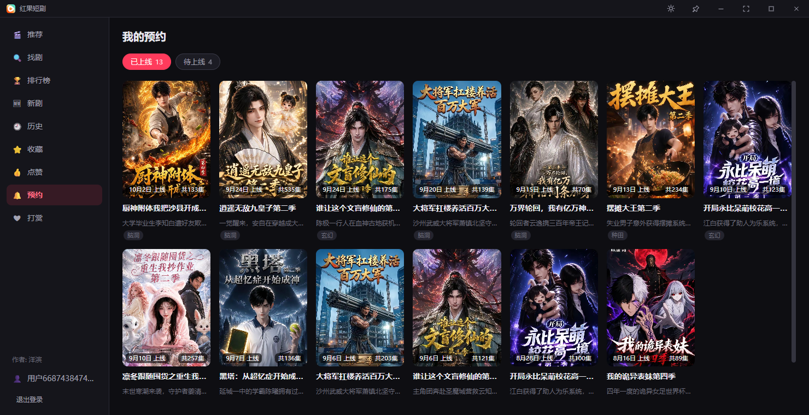

# 红果短剧 PC 播放器

在电脑上刷短剧的桌面播放器, 支持 Windows 与 macOS.

> 本项目为**非官方**的第三方客户端, 与红果短剧官方无关. 仅供个人学习交流, 禁止倒卖.
> 本仓库只用于发布安装包, 不包含源代码.

## 界面预览

**推荐: 沉浸式刷剧**



| 找剧 | 排行榜 |
|---|---|
|  |  |
| **新剧** | **观看历史** |
|  |  |
| **我的收藏** | **我的点赞** |
|  |  |
| **我的预约** | |
|  | |

## 下载

**下载页 (国内可直接打开): https://hongguo.235698.xyz**

也可以到本仓库的 [Releases](../../releases/latest) 页面下载:

| 系统 | 文件 |
|---|---|
| Windows 10 / 11 (64 位) | `hongguo-版本号-windows-amd64.zip` |
| macOS (Intel 与 Apple 芯片通用) | `hongguo-版本号-macos-universal.zip` |

## 安装与运行

**Windows**

1. 解压 zip, 双击 `红果短剧.exe`.
   (以后有新版本时程序会提示, 点 "立即重启更新" 即可自动更新.)
2. 首次运行如果系统缺少 **WebView2 运行时** 或 **HEVC 视频扩展**, 程序会自动安装 (WebView2 需要联网).
3. 系统无法硬件解码 H.265 (精简版系统 / 旧显卡 / 远程桌面等) 时, 程序会自动改用软件解码, 不会只有声音没有画面.

**macOS**

1. 解压得到 `红果短剧.app`, 拖到"应用程序".
2. 应用未签名, 首次打开如提示"已损坏"或"无法验证开发者", 在终端执行:
   ```
   xattr -cr /Applications/红果短剧.app
   ```
   然后再打开.

## 主要功能

- 刷剧: 推荐 / 分类沉浸式刷剧, 边刷边预加载, 滚轮或方向键切换
- 追剧: 底部选集 (1-30 / 31-60 分段跳转)、自动连播下一集与下一季、续播进度
- 分享: 一键复制分享链接 (手机红果 App 可直接打开); 复制别人的红果分享链接后自动识别, 确认即可播放
- 找剧与排行榜: 多维度筛选, 各榜单与热度值
- 新剧推荐、上新日历与预约
- 弹幕 (点赞 / 回复 / +1)、评论与剧评 (多级回复、官方表情)
- 收藏、点赞、观看历史 (未登录时保存在本地, 登录后可上传)
- 小窗模式与隐身模式、浅色 / 深色主题
- 窗口全屏 (Windows 标题栏右上角或 F11, 盖住任务栏); macOS 使用系统红绿灯与菜单栏
- 软件解码兜底: 硬件解码不可用时自动启用, 也可在弹幕设置里手动勾选

## 常见问题

**只有声音, 没有画面?**

新版本 (1.1.5 起) 在硬件解码不可用时会自动改用软件解码, 一般不会再出现; 旧版本请先更新. 仍有问题可按下面排查:

1. 点播放器提示条上的 **"重启程序"**. HEVC 视频扩展刚装上或被微软商店更新后, 要重启程序才能生效.
2. 仍不行就**重启电脑**再试.
3. 扩展自动安装失败时, 程序会把安装包 `HEVC视频扩展-双击安装.appx` 放到程序目录, 双击手动安装.
4. 远程桌面 / 虚拟机通常没有显卡硬件解码, 会使用软件解码 (CPU 占用较高); 画面花屏 / 黑屏时可在弹幕设置里勾选 "软件解码".

还解决不了可以提 [Issue](../../issues) 或加 QQ 联系作者.

## 联系作者

- 作者: 洋滨
- 邮箱: yangbin1322@gmail.com
- QQ: 3177762472

如果觉得好用, 可以在软件的"打赏"页面支持作者 ❤
